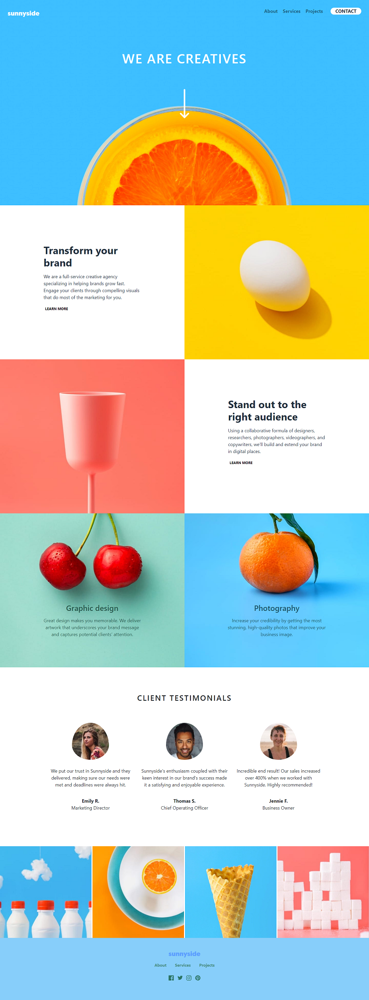
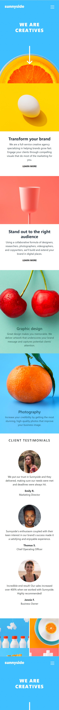

# Frontend Mentor - Sunnyside agency landing page

## Table of contents

- Overview
  - The challenge
  - Screenshot
  - Links
- My process
  - Built with
- Author

## Overview

## The challenge

Your users should be able to:

- View the optimal layout for the site depending on their device's screen size
- See hover states for all interactive elements on the page

### Screenshot

### Links

- Solution URL: https://github.com/Antho137/sunnyside-agency-landing-page
- Live Site URL: https://antho137.github.io/sunnyside-agency-landing-page/

## My process

### Built with

- Semantic HTML5 markup
- CSS custom properties
- Flexbox
- Mobile-first workflow
- Bootstrap

## Author

- Website - "https://antoniosala.online"
- Frontend Mentor - "https://www.frontendmentor.io/profile/Antho137"
- Twitter - "https://www.twitter.com/antoniosala73"